# PrestaShop module — e2e evidence

Generated: 2026-08-28 22:10:48

Every screenshot below was produced by Playwright driving the real
storefront and back office as a shopper/merchant would: navigating,
clicking, typing, and submitting. No database writes, no direct calls
into the module, no POSTs to its own controllers.

## 01-sale

### 01-cart

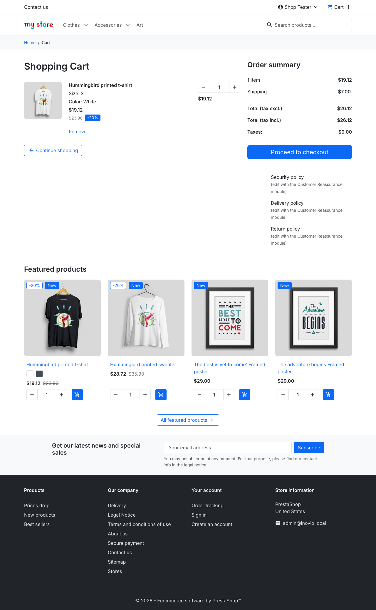

### 02-payment-step

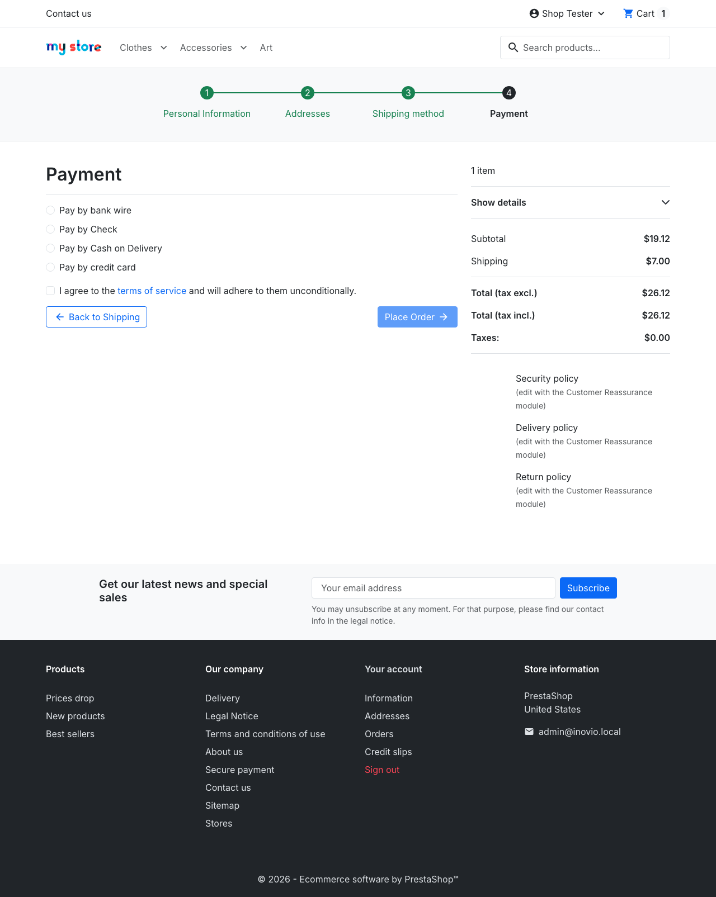

### 03-card-entered

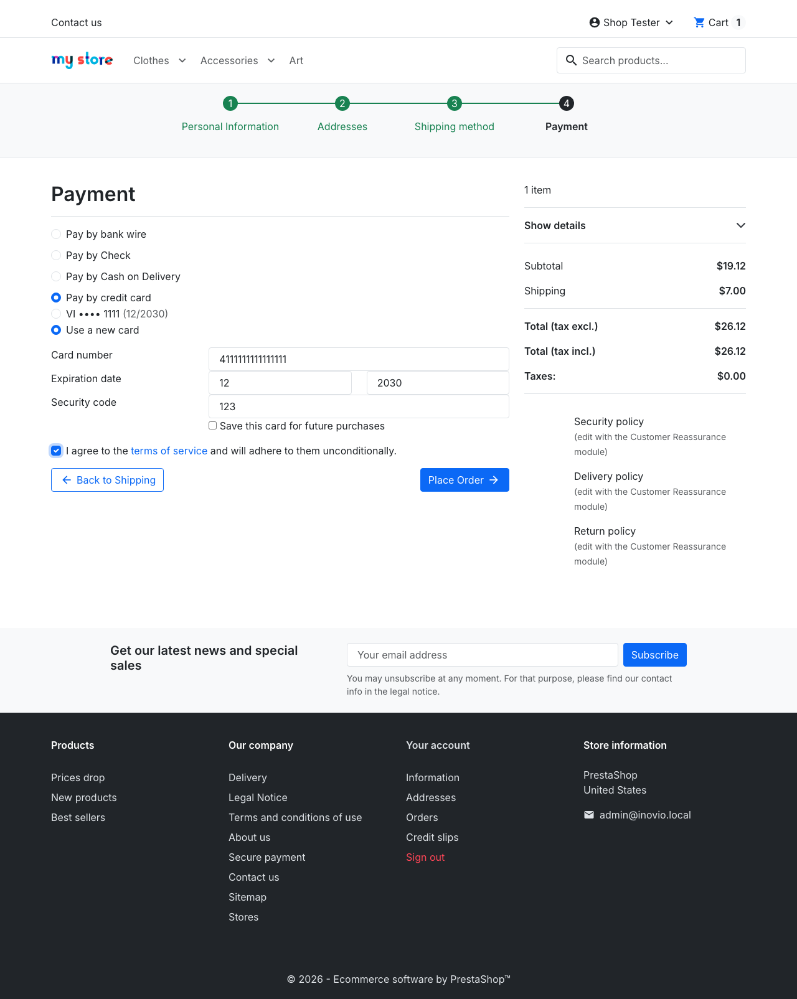

### 04-confirmed

## 02-vault

### 01-save-card-checked

### 02-first-order-confirmed

### 03-saved-card-selected

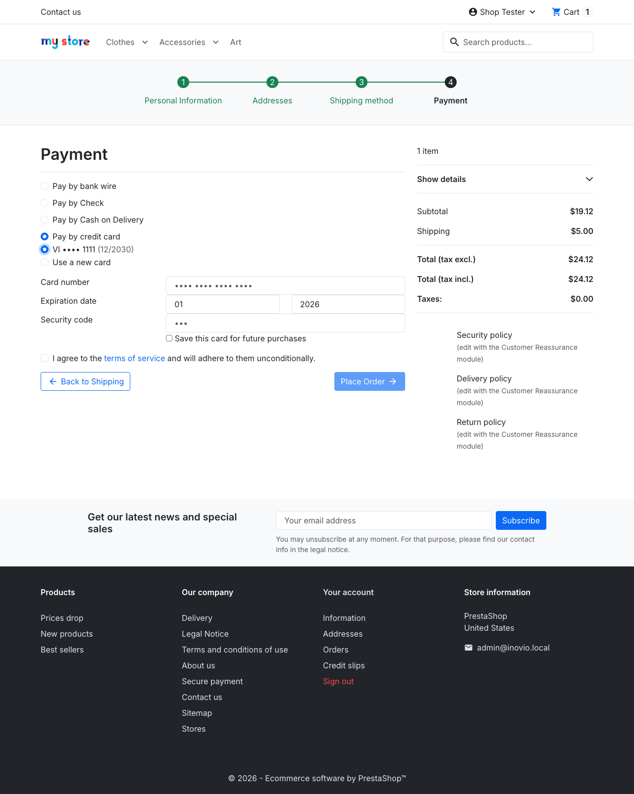

### 04-reuse-confirmed

## 03-vault-account

### 01-saved-cards-page

## 04-3ds

### 01-challenge-pan-entered

### 02-after-place-order

### 03-acs-challenge-visible

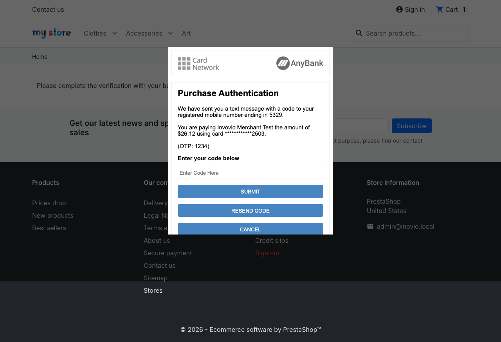

### 04-otp-entered

### 05-confirmed-after-challenge

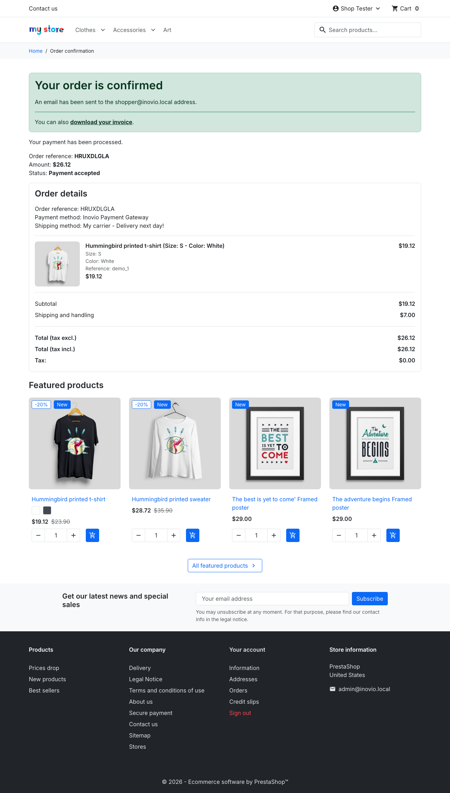

## 05-backoffice

### 01-order-placed

### 02-admin-dashboard

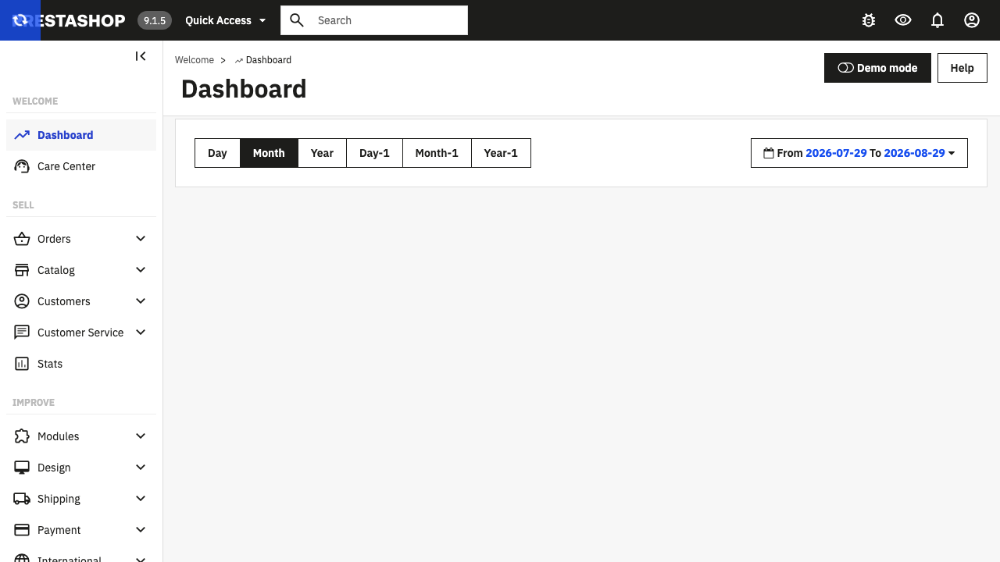

### 03-admin-order-detail



### 04-inovio-panel

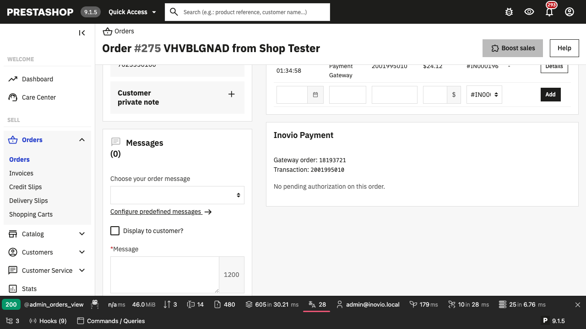

### 05-inovio-panel-closeup

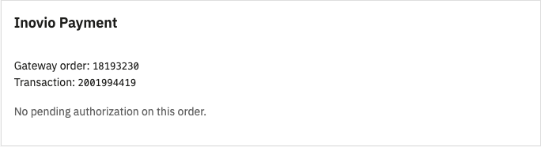

## 06-authorize-capture

### 01-payment-action-authorize

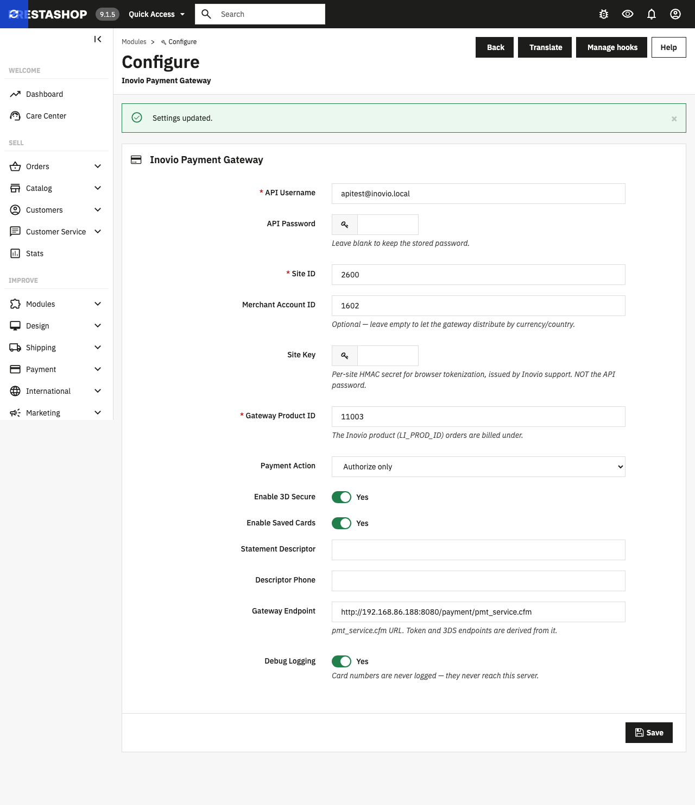

### 02-authorized-order-confirmed

### 03-order-awaiting-capture

### 04-after-capture

## 07-void

### 01-payment-action-authorize

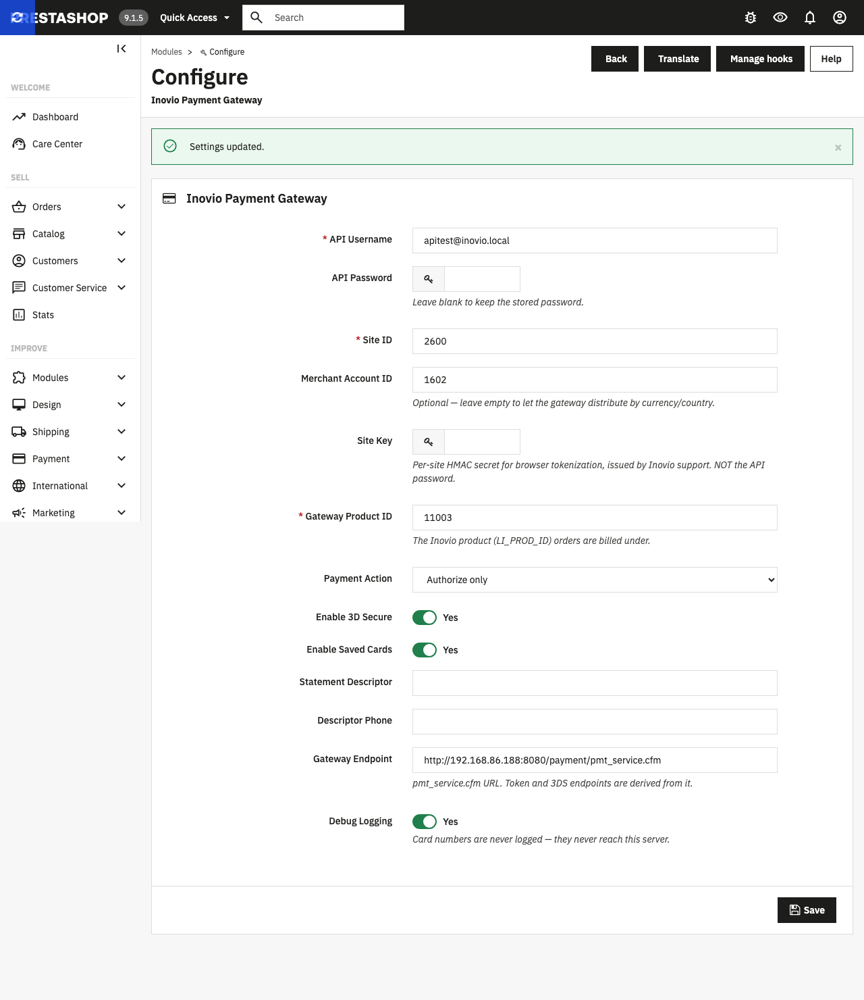

### 02-authorized-order-confirmed

### 03-order-awaiting-capture



### 04-after-void



## 08-refund

### 01-order-placed

### 02-admin-order-detail

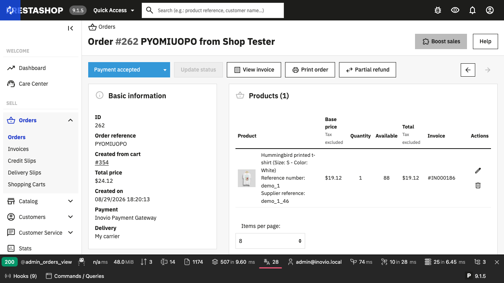

### 03-refund-mode-opened

### 04-product-selected-for-refund

### 05-after-refund-submit

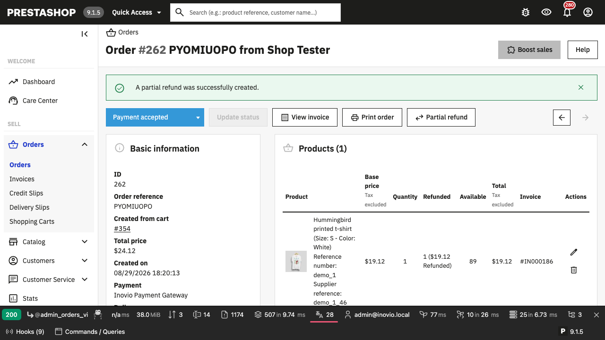

### 06-refund-recorded

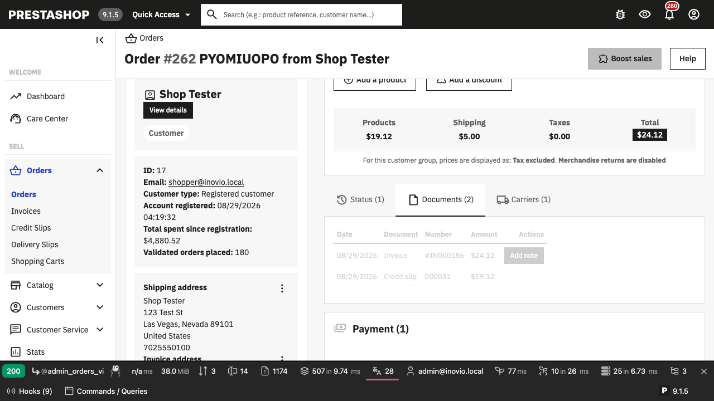

